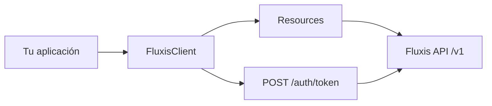

# Fluxis SDK — Inventario de implementación

Referencia técnica para desarrolladores: qué está implementado en el monorepo, dónde vive cada pieza y cómo navegar el código.

> **Fuente de verdad de la API:** [`spec/swagger.yaml`](spec/swagger.yaml)  
> **Contexto compartido para agentes de IA:** [`CLAUDE.md`](CLAUDE.md)

---

## Resumen ejecutivo

| SDK | Paquete | Versión | Estado | Cobertura API |
|-----|---------|---------|--------|---------------|
| **TypeScript / Node.js** | `@fluxisus/sdk` | `0.1.0` | ✅ Implementado | 100% de endpoints públicos |
| **C# / .NET** | `Fluxis.Sdk` | `0.2.0` | ✅ Implementado | 100% de endpoints públicos |
| **Python** | `fluxis` | `0.1.0` | 🚧 Scaffold | Solo estructura de paquete |
| **Go** | `github.com/fluxisus/fluxis-go-sdk` | — | ✅ Public mirror | Repo público `fluxis-go-sdk` |
| **React** | — | — | 📋 Planeado | Workspace declarado, sin código |

Los SDKs implementados son **hand-written** (no auto-generados desde el spec), con auth automática, tipos estrictos y tests.

---

## Arquitectura común

Todos los SDKs completos comparten el mismo diseño:



### Autenticación (dos pasos)

1. `POST /auth/token` con `api_key` + `api_secret` → token PASETO v4 + `expired_at`
2. Cada request lleva:
   - `Authorization: Bearer <token>`
   - `x-fluxis-api-key: <api_key>`

El cliente renueva el token automáticamente **60 segundos antes** de expirar, deduplica auth concurrente y reintenta en `401`.

### Entornos (inferidos del API key)

| Prefijo del key | Base URL |
|-----------------|----------|
| `fxs.stg.*` | `https://api.stgfluxis.us/v1` |
| `fxs.prd.*` | `https://api.fluxis.us/v1` |

### Envelope de respuesta

```json
{ "status": "success", "data": { ... } }
{ "status": "error", "code": "AK0001", "message": "...", "details": "..." }
```

### Recursos del cliente

| Recurso | Responsabilidad |
|---------|-----------------|
| `accounts` | CRUD de cuentas + settlement addresses |
| `organization` | Settlement addresses a nivel organización |
| `pointOfSale` | PoS, webhooks, payment requests, checkout |
| `naspip` | Crear y leer tokens NASPIP (PASETO v4) |
| `refunds` | Reembolsos de payment requests |
| `transactions` | Listado paginado con filtros |

---

## Mapa completo: API → SDK

| Método | Endpoint API | TypeScript | C# |
|--------|--------------|------------|-----|
| `POST` | `/auth/token` | Interno en [`client.ts`](packages/backend/sdk/src/client.ts) | Interno en [`FluxisClient.cs`](packages/backend/sdk-csharp/src/Fluxis/FluxisClient.cs) |
| `GET` | `/account` | `accounts.list()` | `Accounts.ListAsync()` |
| `POST` | `/account` | `accounts.create()` | `Accounts.CreateAsync()` |
| `GET` | `/account/{accountId}` | `accounts.get()` | `Accounts.GetAsync()` |
| `PUT` | `/account/{accountId}` | `accounts.update()` | `Accounts.UpdateAsync()` |
| `DELETE` | `/account/{accountId}` | `accounts.delete()` | `Accounts.DeleteAsync()` |
| `GET` | `/account/{accountId}/settlement-addresses` | `accounts.getSettlementAddresses()` | `Accounts.GetSettlementAddressesAsync()` |
| `POST` | `/account/settlement/{accountID}/settlement-addresses` | `accounts.setSettlementAddress()` | `Accounts.SetSettlementAddressAsync()` |
| `PUT` | `/account/settlement/{accountID}/settlement-addresses` | `accounts.updateSettlementAddress()` | `Accounts.UpdateSettlementAddressAsync()` |
| `POST` | `/organization/settlement-addresses` | `organization.setSettlementAddresses()` | `Organization.SetSettlementAddressesAsync()` |
| `PUT` | `/organization/settlement-addresses` | `organization.updateSettlementAddresses()` | `Organization.UpdateSettlementAddressesAsync()` |
| `GET` | `/pos` | `pointOfSale.list()` | `PointOfSale.ListAsync()` |
| `POST` | `/pos` | `pointOfSale.create()` | `PointOfSale.CreateAsync()` |
| `GET` | `/pos/{posId}` | `pointOfSale.get()` | `PointOfSale.GetAsync()` |
| `PUT` | `/pos/{posId}` | `pointOfSale.update()` | `PointOfSale.UpdateAsync()` |
| `GET` | `/pos/{posId}/notifications` | `pointOfSale.getNotifications()` | `PointOfSale.GetNotificationsAsync()` |
| `POST` | `/pos/{posId}/notifications` | `pointOfSale.createNotifications()` | `PointOfSale.CreateNotificationsAsync()` |
| `PUT` | `/pos/{posId}/notifications` | `pointOfSale.updateNotifications()` | `PointOfSale.UpdateNotificationsAsync()` |
| `POST` | `/pos/{posId}/payment-request` | `pointOfSale.createPaymentRequest()` | `PointOfSale.CreatePaymentRequestAsync()` |
| `GET` | `/pos/{posId}/payment-request/{id}` | `pointOfSale.getPaymentRequest()` | `PointOfSale.GetPaymentRequestAsync()` |
| `POST` | `/pos/{posId}/payment-request-checkout` | `pointOfSale.createPaymentRequestCheckout()` | `PointOfSale.CreatePaymentRequestCheckoutAsync()` |
| `POST` | `/naspip/create` | `naspip.create()` | `Naspip.CreateAsync()` |
| `POST` | `/naspip/read` | `naspip.read()` | `Naspip.ReadAsync()` |
| `POST` | `/refunds/payment-request/{id}` | `refunds.create()` | `Refunds.CreateAsync()` |
| `GET` | `/refunds/{refundId}` | `refunds.get()` | `Refunds.GetAsync()` |
| `GET` | `/transactions` | `transactions.list()` | `Transactions.ListAsync()` |

### Utilidades fuera de la API REST

| Utilidad | TypeScript | C# |
|----------|------------|-----|
| Verificar firma de webhook (HMAC-SHA256) | [`verifyWebhookSignature()`](packages/backend/sdk/src/webhooks.ts) | [`WebhookVerifier.VerifySignature()`](packages/backend/sdk-csharp/src/Fluxis/Utilities/WebhookVerifier.cs) |
| Validar formato NASPIP (`v4.local.`) | `naspip.isValidTokenFormat()` | `NaspipResource.IsValidTokenFormat()` (static) |
| Conversión camelCase ↔ snake_case | [`utils.ts`](packages/backend/sdk/src/utils.ts) | `[JsonPropertyName]` por propiedad |

---

## TypeScript SDK (`@fluxisus/sdk`)

**Documentación:** [`packages/backend/sdk/README.md`](packages/backend/sdk/README.md) · [`packages/backend/sdk/CLAUDE.md`](packages/backend/sdk/CLAUDE.md) · [`packages/backend/sdk/llms-full.txt`](packages/backend/sdk/llms-full.txt)

| Aspecto | Detalle |
|---------|---------|
| Instalación | `npm install @fluxisus/sdk` |
| Node.js | ≥ 18 (native `fetch`, `crypto.subtle`) |
| Dependencias runtime | **Cero** |
| Build | [`tsup`](packages/backend/sdk/tsup.config.ts) → ESM + CJS |
| Tests | [`vitest`](packages/backend/sdk/vitest.config.ts) |

### Estructura de archivos

```
packages/backend/sdk/
├── src/
│   ├── client.ts              # FluxisClient — auth, HTTP, retry 401
│   ├── index.ts               # Exports públicos
│   ├── errors.ts              # FluxisError, FluxisAuthError, FluxisNetworkError, FluxisResponseParseError
│   ├── utils.ts               # keysToCamelCase / keysToSnakeCase
│   ├── webhooks.ts            # verifyWebhookSignature()
│   ├── resources/
│   │   ├── accounts.ts
│   │   ├── organization.ts
│   │   ├── pointOfSale.ts
│   │   ├── naspip.ts
│   │   ├── refunds.ts
│   │   └── transactions.ts
│   └── types/
│       ├── common.ts          # Enums, Order, Merchant, ApiResponse
│       ├── auth.ts
│       ├── accounts.ts
│       ├── organization.ts
│       ├── pointOfSale.ts
│       ├── naspip.ts
│       ├── refunds.ts
│       └── transactions.ts
├── tests/
│   ├── client.test.ts         # Auth, base URL, errores, retry
│   ├── resources.test.ts      # Rutas y métodos HTTP por recurso
│   ├── naspip.test.ts
│   ├── webhooks.test.ts
│   ├── utils.test.ts
│   └── errors.test.ts
├── .env.example
└── package.json
```

### Características del cliente

- **Timeout configurable** (default 30s) vía `FluxisClientOptions.timeout`
- **Conversión automática** camelCase (TS) ↔ snake_case (API)
- **Query param especial** en transactions: `accountId` → `accountID`
- **Errores tipados** con `code`, `details`, `statusCode`, `method`, `path`

### Tipos y enums exportados

Definidos en [`types/common.ts`](packages/backend/sdk/src/types/common.ts):

- `PaymentRequestStatus`: `created` · `processing` · `expired` · `completed` · `overpaid` · `underpaid` · `failed`
- `TransactionType`: `deposit` · `withdraw` · `refund` · `adjustment` · `swap` · `payment_in` · `payment_out` · `dry_run`
- `TransactionStatus`: `preview` · `pending` · `created` · `processing` · `error` · `expired` · `failed` · `completed`
- `CountryCode`: `AR` · `BR` · `DK`
- `EntityType`, `TransactionDetailType`, `Merchant`, `Order`, `OrderItem`, `SettlementAddress`

### Comandos

```bash
cd packages/backend/sdk
npm ci && npm run build && npm test && npm run lint
```

---

## C# SDK (`Fluxis.Sdk`)

**Documentación:** [`packages/backend/sdk-csharp/README.md`](packages/backend/sdk-csharp/README.md) · [`packages/backend/sdk-csharp/CLAUDE.md`](packages/backend/sdk-csharp/CLAUDE.md) · [`packages/backend/sdk-csharp/llms-full.txt`](packages/backend/sdk-csharp/llms-full.txt) · [`CHANGELOG.md`](packages/backend/sdk-csharp/CHANGELOG.md)

| Aspecto | Detalle |
|---------|---------|
| Instalación | `dotnet add package Fluxis.Sdk` |
| Target frameworks | `net8.0` + `net6.0` |
| Dependencias | Solo `System.Text.Json` |
| Nullable | Habilitado |
| XML docs | Generados en build |

### Estructura de archivos

```
packages/backend/sdk-csharp/
├── src/Fluxis/
│   ├── FluxisClient.cs
│   ├── FluxisClientOptions.cs
│   ├── Resources/
│   │   ├── AccountsResource.cs
│   │   ├── OrganizationResource.cs
│   │   ├── PointOfSaleResource.cs
│   │   ├── NaspipResource.cs
│   │   ├── RefundsResource.cs
│   │   └── TransactionsResource.cs
│   ├── Models/
│   │   ├── Common.cs          # ApiResponse<T>, enums
│   │   ├── Auth.cs
│   │   ├── Account.cs
│   │   ├── Organization.cs
│   │   ├── PointOfSale.cs     # PoS, PaymentRequest, Notifications
│   │   ├── Naspip.cs
│   │   ├── Refund.cs
│   │   └── Transaction.cs
│   ├── Errors/
│   │   ├── FluxisException.cs
│   │   └── FluxisAuthException.cs
│   └── Utilities/
│       └── WebhookVerifier.cs
├── tests/
│   ├── FluxisClientTests.cs
│   ├── WebhookVerifierTests.cs
│   ├── NaspipResourceTests.cs
│   └── ModelSerializationTests.cs
├── examples/Fluxis.Example/Program.cs
└── Fluxis.Sdk.csproj
```

### Características del cliente

- **DI-friendly**: constructor con `HttpClient` externo o managed internamente
- **Thread-safe auth**: `SemaphoreSlim` con double-check locking
- **`CancellationToken`** en todos los métodos async públicos
- **Sufijo `Async`** en todos los métodos HTTP
- **`IDisposable`**: libera `HttpClient` si fue creado internamente
- **Serialización**: `[JsonPropertyName("snake_case")]` explícito por propiedad

### Errores

| Clase | Uso |
|-------|-----|
| [`FluxisException`](packages/backend/sdk-csharp/src/Fluxis/Errors/FluxisException.cs) | Errores de API y red (`ErrorCode`, `StatusCode`, `HttpMethod`, `RequestPath`) |
| [`FluxisAuthException`](packages/backend/sdk-csharp/src/Fluxis/Errors/FluxisAuthException.cs) | Fallos de autenticación |

### Comandos

```bash
cd packages/backend/sdk-csharp
dotnet build && dotnet test
```

---

## Python SDK (`fluxis`) — Pendiente

**Documentación planificada:** [`packages/backend/sdk-python/README.md`](packages/backend/sdk-python/README.md) · [`packages/backend/sdk-python/CLAUDE.md`](packages/backend/sdk-python/CLAUDE.md)

| Aspecto | Estado actual |
|---------|---------------|
| Código fuente | Solo [`__init__.py`](packages/backend/sdk-python/src/fluxis/__init__.py) con `__version__` |
| Config build | [`pyproject.toml`](packages/backend/sdk-python/pyproject.toml) (hatchling, httpx, pytest, ruff, mypy) |
| Tests | Carpeta `tests/` referenciada pero sin implementar |
| Publish script | [`scripts/publish-pypi.sh`](scripts/publish-pypi.sh) (listo para cuando exista el SDK) |
| CI | [`.github/workflows/sdk-python.yml`](.github/workflows/sdk-python.yml) |

Diseño previsto (ver CLAUDE.md): async-first con `httpx`, sync wrapper, `verify_webhook_signature()`, snake_case nativo.

---

## Go SDK — Pendiente

**Documentación planificada:** [`packages/backend/sdk-go/README.md`](packages/backend/sdk-go/README.md) · [`packages/backend/sdk-go/CLAUDE.md`](packages/backend/sdk-go/CLAUDE.md)

| Aspecto | Estado actual |
|---------|---------------|
| Código fuente | Sin archivos `.go` |
| Módulo | [`go.mod`](packages/backend/sdk-go/go.mod) (`go 1.22`) |
| CI | [`.github/workflows/sdk-go.yml`](.github/workflows/sdk-go.yml) |

Diseño previsto (ver CLAUDE.md): stdlib only, functional options, `context.Context` first, `VerifyWebhookSignature()`.

---

## Flujos de pago implementados

### 1. Pago directo (crypto)

Especificás el asset exacto → recibís un **token NASPIP** para QR/NFC.

```typescript
// TypeScript
const payment = await fluxis.pointOfSale.createPaymentRequest(posId, {
  amount: '25.00',
  uniqueAssetId: 'npolygon_t0x3c499c542cEF5E3811e1192ce70d8cC03d5c3359',
  referenceId: 'order-001',
});
// → { id, status, token, referenceId, expiration }
```

```csharp
// C#
var payment = await client.PointOfSale.CreatePaymentRequestAsync(posId,
    new CreatePaymentRequestRequest { Amount = "25.00", UniqueAssetId = "...", ReferenceId = "order-001" });
```

### 2. Hosted checkout (fiat de referencia)

Especificás moneda fiat → recibís una **URL de checkout** hospedada.

```typescript
const checkout = await fluxis.pointOfSale.createPaymentRequestCheckout(posId, {
  amount: '49.99',
  coinCode: 'USD',
  referenceId: 'order-002',
});
// → { checkoutUrl, status, ... }
```

### 3. NASPIP

- **No decodificar localmente** — usar `naspip.read()` / `Naspip.ReadAsync()`
- Formato: PASETO v4 con prefijo `v4.local.`
- Unique Asset ID: `n{network}_t{tokenAddress}`

| Asset | Network | Unique Asset ID |
|-------|---------|-----------------|
| USDC | Polygon | `npolygon_t0x3c499c542cEF5E3811e1192ce70d8cC03d5c3359` |
| USDT | Polygon | `npolygon_t0xc2132D05D31c914a87C6611C10748AEb04B58e8F` |

### 4. Webhooks

1. Crear notificaciones en el PoS → recibís el **secret** (una sola vez)
2. Fluxis envía eventos firmados con header `x-fluxis-signature`
3. Verificar con HMAC-SHA256 antes de procesar

### 5. Ciclo de vida del payment request

```
created → processing → completed
              ├── overpaid
              └── underpaid
created → expired
created → failed
```

---

## Ejemplos

| Ejemplo | Archivo | Descripción |
|---------|---------|-------------|
| Crear PoS + payment request | [`examples/demo-checkout/create-payment.ts`](examples/demo-checkout/create-payment.ts) | Flujo crypto básico |
| Hosted checkout | [`examples/demo-checkout/checkout-flow.ts`](examples/demo-checkout/checkout-flow.ts) | Flujo con URL de checkout |
| Leer token NASPIP | [`examples/demo-checkout/read-naspip-token.ts`](examples/demo-checkout/read-naspip-token.ts) | Verificar/decodificar token |
| C# flujo completo | [`packages/backend/sdk-csharp/examples/Fluxis.Example/Program.cs`](packages/backend/sdk-csharp/examples/Fluxis.Example/Program.cs) | PoS, payment, NASPIP, webhooks |

Variables de entorno para ejemplos:

| Variable | Uso |
|----------|-----|
| `FLUXIS_API_KEY` | `fxs.stg.*` o `fxs.prd.*` |
| `FLUXIS_API_SECRET` | Secret de la API key |
| `FLUXIS_POS_ID` | ID del Point of Sale (ejemplo C#) |

Ver también [`packages/backend/sdk/.env.example`](packages/backend/sdk/.env.example).

---

## Tests

### TypeScript

| Archivo | Qué cubre |
|---------|-----------|
| [`client.test.ts`](packages/backend/sdk/tests/client.test.ts) | Base URL, auth lazy, refresh, retry 401, errores de red/parse |
| [`resources.test.ts`](packages/backend/sdk/tests/resources.test.ts) | Método HTTP + path correcto por cada recurso |
| [`naspip.test.ts`](packages/backend/sdk/tests/naspip.test.ts) | `isValidTokenFormat()` |
| [`webhooks.test.ts`](packages/backend/sdk/tests/webhooks.test.ts) | Verificación HMAC |
| [`utils.test.ts`](packages/backend/sdk/tests/utils.test.ts) | Conversión de case |
| [`errors.test.ts`](packages/backend/sdk/tests/errors.test.ts) | Jerarquía de errores |

> Los tests de `client.test.ts` y `resources.test.ts` usan mocks de `fetch`. CI también corre con credenciales de staging (`FLUXIS_API_KEY` / `FLUXIS_API_SECRET`).

### C#

| Archivo | Qué cubre |
|---------|-----------|
| [`FluxisClientTests.cs`](packages/backend/sdk-csharp/tests/FluxisClientTests.cs) | Construcción, validación de options, recursos expuestos |
| [`WebhookVerifierTests.cs`](packages/backend/sdk-csharp/tests/WebhookVerifierTests.cs) | Firma HMAC |
| [`NaspipResourceTests.cs`](packages/backend/sdk-csharp/tests/NaspipResourceTests.cs) | `IsValidTokenFormat()` |
| [`ModelSerializationTests.cs`](packages/backend/sdk-csharp/tests/ModelSerializationTests.cs) | Serialización JSON snake_case |

Framework: **xUnit** + **FluentAssertions**.

---

## CI/CD y releases

| Workflow | Archivo | Trigger |
|----------|---------|---------|
| TypeScript | [`.github/workflows/sdk-typescript.yml`](.github/workflows/sdk-typescript.yml) | Cambios en `packages/backend/sdk/**` |
| C# | [`.github/workflows/sdk-csharp.yml`](.github/workflows/sdk-csharp.yml) | Cambios en `packages/backend/sdk-csharp/**` |
| Python | [`.github/workflows/sdk-python.yml`](.github/workflows/sdk-python.yml) | Cambios en `packages/backend/sdk-python/**` |
| Go | [`.github/workflows/sdk-go.yml`](.github/workflows/sdk-go.yml) | Cambios en `packages/backend/sdk-go/**` |
| Validar spec | [`.github/workflows/validate-spec.yml`](.github/workflows/validate-spec.yml) | Cambios en `spec/**` |
| Release Please | [`.github/workflows/release-please.yml`](.github/workflows/release-please.yml) | Automatización de versiones |

### Scripts de publicación

| Script | Destino |
|--------|---------|
| [`scripts/publish-npm.sh`](scripts/publish-npm.sh) | npm (`@fluxisus/sdk`) |
| [`scripts/publish-nuget.sh`](scripts/publish-nuget.sh) | NuGet (`Fluxis.Sdk`) |
| [`scripts/publish-pypi.sh`](scripts/publish-pypi.sh) | PyPI (`fluxis`) — futuro |
| [`scripts/validate-spec.sh`](scripts/validate-spec.sh) | Lint del OpenAPI spec |

### Tags de release

| SDK | Tag | Registry |
|-----|-----|----------|
| TypeScript | `typescript-sdk/vX.Y.Z` | npm |
| C# | `csharp-sdk/vX.Y.Z` | NuGet |

---

## Documentación y referencias para desarrolladores

### Documentación del repo

| Recurso | Descripción |
|---------|-------------|
| [`README.md`](README.md) | Overview del monorepo + quick start |
| [`CLAUDE.md`](CLAUDE.md) | API completa, schemas, convenciones cross-SDK |
| [`spec/swagger.yaml`](spec/swagger.yaml) | OpenAPI — fuente de verdad |
| [`AI-INTEGRATION.es.md`](AI-INTEGRATION.es.md) | Integrar Fluxis con editores de IA (español) |
| [`AI-INTEGRATION.en.md`](AI-INTEGRATION.en.md) | AI-assisted integration guide (English) |

### Documentación para LLMs (llms.txt)

| Archivo | Contenido |
|---------|-----------|
| [`llms.txt`](llms.txt) | Índice de SDKs + conceptos compartidos |
| [`packages/backend/sdk/llms-full.txt`](packages/backend/sdk/llms-full.txt) | Guía completa TypeScript |
| [`packages/backend/sdk-csharp/llms-full.txt`](packages/backend/sdk-csharp/llms-full.txt) | Guía completa C# |

URLs raw para compartir con cualquier LLM:

```
https://raw.githubusercontent.com/fluxisus/fluxis-sdk/main/llms.txt
https://raw.githubusercontent.com/fluxisus/fluxis-sdk/main/packages/backend/sdk/llms-full.txt
https://raw.githubusercontent.com/fluxisus/fluxis-sdk/main/packages/backend/sdk-csharp/llms-full.txt
```

### Context7 (MCP para Cursor y otros)

Fluxis está publicado en [Context7](https://context7.com/fluxisus/fluxis-sdk). Ver setup en [`README.md`](README.md#ai-assisted-integration) y [`AI-INTEGRATION.es.md`](AI-INTEGRATION.es.md).

### Convenciones por lenguaje

| SDK | Convención de nombres | Case conversion |
|-----|----------------------|-----------------|
| TypeScript | camelCase | Automática (`utils.ts`) |
| C# | PascalCase + `[JsonPropertyName]` | Explícita por propiedad |
| Python (planificado) | snake_case | No necesaria |
| Go (planificado) | PascalCase + `json:"snake_case"` | Struct tags |

---

## Checklist rápido para integrar

- [ ] Obtener API key de staging (`fxs.stg.*`) o producción (`fxs.prd.*`)
- [ ] Instalar SDK (TS o C#)
- [ ] Crear o reutilizar un Point of Sale
- [ ] Configurar webhooks (`createNotifications`) y guardar el secret
- [ ] Elegir flujo: `createPaymentRequest` (QR) o `createPaymentRequestCheckout` (URL)
- [ ] Verificar pagos vía webhook (primario) o `getPaymentRequest` (secundario)
- [ ] Usar `naspip.read()` si necesitás decodificar un token
- [ ] Nunca exponer `api_secret` ni usar el client en código browser-side

---

## Qué falta implementar

| Item | Prioridad sugerida | Referencia de diseño |
|------|-------------------|---------------------|
| Python SDK completo | Alta | [`packages/backend/sdk-python/CLAUDE.md`](packages/backend/sdk-python/CLAUDE.md) |
| Go SDK completo | Alta | [`packages/backend/sdk-go/CLAUDE.md`](packages/backend/sdk-go/CLAUDE.md) |
| React bindings | Media | Declarado en root `package.json` workspaces |
| Helper `isValidTokenFormat` exportado en TS index | Baja | Existe en resource, no en [`index.ts`](packages/backend/sdk/src/index.ts) |

---

*Última revisión del inventario: junio 2026 — basada en el estado actual del repositorio.*
